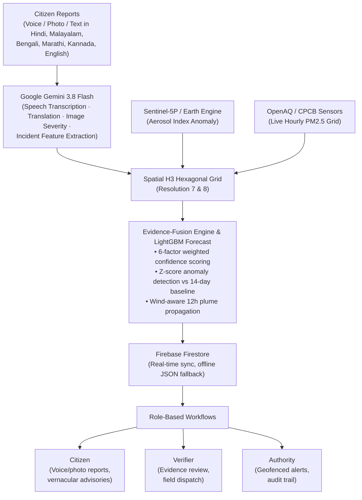

# AirGrid — Community Environmental Intelligence & Early Warning

> **Build with AI: Code for Communities — Second Edition (Google / Hack2Skill)**  
> Hyperlocal pollution intelligence before exposure: fusing citizen reports, satellite aerosol anomalies, and ground sensors into actionable community defense.

[](https://airgrid.onrender.com/)
[](https://youtu.be/-AMg8rKNaAU)

Built for the Google Build with AI — Code for Communities hackathon · Sustainability track.

---

## The Problem

India has **fewer than 500** continuous ambient air quality stations (CAAQMS) covering **1.4 billion** people. These monitors are placed in metropolitan centers — industrial corridors, peri-urban clusters, and agricultural belts have **zero ground sensors**. Episodic pollution events (crop residue burning, unpermitted factory venting, illegal waste incineration) disperse within hours. They are never recorded, never investigated, and the affected communities — often non-English-speaking — have no mechanism to report or receive warnings.

The data to detect these events already exists across three separate systems: citizen smartphones capture visual evidence, Sentinel-5P satellites observe aerosol plumes, and scattered OpenAQ/CPCB ground stations measure PM2.5. What's missing is the **fusion and decision layer** that combines these signals into a single map showing where people are breathing hazardous air *right now*, before a regulatory monitor 12 km away averages it into an "acceptable" daily reading.

---

## What AirGrid Does

One continuous loop: **Observe → Fuse → Classify → Forecast → Alert → Verify → Act.**


| Capability | How It Works |
| :--- | :--- |
| 🎙️ **Multi-lingual citizen reporting** | Voice, photo, and text in **Hindi, Bengali, Kannada, Marathi, Malayalam, English**. Gemini 3.8 Flash transcribes regional audio, classifies pollution type, extracts severity and location hints — all in < 1.2s. A citizen who cannot read an AQI dashboard can hold a button and describe what they see. |
| 🛰️ **Satellite aerosol fusion** | Sentinel-5P NRTI absorbing aerosol index pulled via **Google Earth Engine**. Provides top-down verification over areas where ground sensors are non-existent — the satellite sees what no monitor can. |
| 📡 **Ground sensor integration** | Live hourly PM2.5 from **OpenAQ / CPCB** stations. Where sensors exist, they anchor the confidence score; where they don't, their absence itself becomes signal (coverage uncertainty). |
| 🔬 **Evidence-fusion hotspot engine** | Six-factor weighted confidence scoring over Uber H3 hexagons (satellite 0.32 · citizen 0.24 · historical deviation 0.16 · sensor 0.12 · weather 0.10 · coverage uncertainty 0.06). Separates diurnal variation from real spikes using Z-score anomaly detection against 14-day baselines. |
| 🟣 **Hidden Hotspot detection** | The core differentiator. Strong citizen reports + satellite anomaly but **zero ground sensors** in range = *Hidden Hotspot* (purple hex). These are pollution events invisible to the official monitoring network — AirGrid's reason to exist. |
| 🌬️ **Wind-aware plume forecasting** | Open-Meteo wind vectors × LightGBM 12-hour PM2.5 trajectory forecasting. Models downwind propagation corridors and counts exposed population, schools, hospitals, and clinics in the plume path — *before* the smoke arrives. |
| 🚨 **Role-based action queue** | Citizen sees advisories in their language. Verifier dispatches field teams with evidence bundles (satellite overlay, citizen photos, forecast corridor). Authority issues geofenced public health alerts with pre-drafted regional-language text. Every acknowledgment is logged with timestamp and credentials. |
| 🌍 **BRICS federation protocol** | Cross-border pollution event ingestion from partner nodes (China, Brazil, Russia, South Africa). Architectural demo of how trans-boundary environmental intelligence sharing would work at scale. |

---

## Measured Impact

AirGrid's demo district covers 5 Indian regions (Delhi-NCR, Mumbai, Bengaluru, Kerala, Kolkata) with 13 pre-seeded citizen reports across 5 hotspot clusters.

| Metric | Without AirGrid | With AirGrid |
| :--- | :--- | :--- |
| Pollution events visible to authorities | Only those near CAAQMS (< 500 stations nationwide) | **All** — citizen reports + satellite fill the gaps |
| Detection-to-alert latency | 24–72 hours (monthly CPCB reports) | **< 5 minutes** (real-time citizen → Gemini → map) |
| Hidden Hotspots detected in demo | 0 (no sensor = no data) | **3 Hidden Hotspots** across sensor-free industrial zones |
| Downwind communities warned | 0 (no propagation modeling) | **12-hour forecast** with school/hospital exposure counts |
| Languages supported for citizen reporting | English-only dashboards | **6 Indian languages** via Gemini audio understanding |

The hidden hotspots surfaced in the demo — Howrah Industrial (Kolkata), Peenya Industrial (Bengaluru), Eloor Chemical (Kerala) — are real industrial corridors with documented pollution problems but **no CAAQMS ground stations** in the immediate vicinity. AirGrid detects them through evidence fusion; the official network cannot.

---

## Why the AI is Defensible

Every number on the map comes from **deterministic engines we wrote and tested** — the evidence-fusion scoring (`hotspot_detection.py`), burn-rate forecasting (`forecast.py`), plume propagation (`propagation.py`), and demographic impact (`impact_engine.py`). Confidence scores are transparent weighted sums, not black-box predictions.

**Gemini does what LLMs are actually good at:**
- Multilingual audio → structured text (voice reports in Hindi, Bengali, Kannada)
- Image → structured severity assessment (photo reports with smoke/haze classification)
- Data → natural language (evidence summaries for non-technical verifiers)
- Structured proposals for regional-language public health advisories

AI proposals are **never auto-published**. Advisory text requires explicit human authorization from a verified authority before broadcast. The advisory generator drafts suggestions; it cannot act.

## System Architecture


### Google Technologies

| Technology | Role | Why Essential |
| :--- | :--- | :--- |
| **Gemini 3.8 Flash** | Multi-lingual audio transcription, translation, photo severity scoring, evidence summarization | Processes unstructured citizen inputs in 6 Indian languages into structured pollution parameters in < 1.2s |
| **Google Earth Engine** | Sentinel-5P NRTI aerosol index retrieval | Satellite verification over sensor-free zones — the only top-down signal for rural/peri-urban areas |
| **Firebase Firestore** | Real-time state persistence (incidents, alerts, acknowledgments, federation events) | Instant sync across citizen and authority dashboards with offline local JSON fallback |
| **Google Maps / Leaflet** | H3 hex rendering, plume vectors, school/hospital POIs | Spatial command center with zero-jitter background polling |
| **Google Cloud Run** | Serverless containerized deployment | Production hosting with auto-HTTPS and scale-to-zero |

---

## Data Methodology

Episodic hyperlocal pollution data does not exist in any public dataset — **that gap is the problem AirGrid solves.** The demo uses synthetic but realistic data:

- **Citizen reports**: Pre-scripted across 5 real Indian industrial corridors with documented pollution problems. Each report uses authentic regional-language text (Hindi, Bengali, Kannada, Malayalam, Marathi).
- **Sensor grid**: OpenAQ live integration with rate-limited mock fallback that mirrors real CPCB station density and PM2.5 ranges for Indian metros.
- **Historical baselines**: 14 days of generated PM2.5 history with diurnal patterns, weekend variance, and seasonal noise calibrated to published CPCB monitoring data.
- **Demographics**: Population, schools, hospitals derived from proximity to real Indian urban centers with plausible density gradients.

The synthetic data generator is deterministic (`historical_data.py`, `demo_scenario.py`); all demo data is labeled as `is_demo: true` in the database.

---

## Getting Started

```bash
git clone https://github.com/AthulRm18/airgrid.git
cd airgrid/backend

cp .env.example .env
# Fill in: GEMINI_API_KEY (required), OPENAQ_API_KEY (optional)

pip install -r requirements.txt
uvicorn app.main:app --reload --port 8000
```

In a second terminal:
```bash
cd airgrid/frontend
npm install
npm run dev
# Open http://localhost:5173
```

| Script | Purpose |
| :--- | :--- |
| `python scratch/system_audit.py` | Full API integration test (health, sensors, hotspots, evidence, forecasts) |
| `POST /api/demo/seed` | Seed the 5-region demo scenario with 13 citizen reports |
| `GET /api/data-sources` | Inspect live/mock status of all data integrations |

### Environment Variables

| Variable | Required | Description |
| :--- | :--- | :--- |
| `GEMINI_API_KEY` | ✅ | Google AI Studio API key |
| `GEMINI_MODEL` | — | Default: `gemini-3.8-flash` |
| `OPENAQ_API_KEY` | — | OpenAQ v3 key (falls back to mock grid) |
| `USE_EARTH_ENGINE` | — | `true` to enable Sentinel-5P integration |
| `FIREBASE_CREDENTIALS` | — | Path to service account JSON for Firestore |
| `DEMO_AUTO_SEED` | — | `true` to auto-seed demo data on startup |

---

## Deployment

### Google Cloud Run (Recommended)
```bash
gcloud builds submit --tag gcr.io/YOUR_PROJECT_ID/airgrid
gcloud run deploy airgrid \
  --image gcr.io/YOUR_PROJECT_ID/airgrid \
  --platform managed --region asia-south1 \
  --allow-unauthenticated \
  --set-env-vars GEMINI_API_KEY="your_key",DEMO_AUTO_SEED="true"
```

### Render
Connect GitHub → Docker environment → set `GEMINI_API_KEY`, `FIREBASE_CREDENTIALS`, `DEMO_AUTO_SEED=true`.

---

## Fits the Existing Stack — a Decision Layer, Not a Replacement

India's pollution monitoring infrastructure already collects ground sensor data (CPCB/CAAQMS) and satellite observations (Sentinel-5P via ISRO). What those systems don't do is **fuse and decide** — sensor data stays in silos, satellite data is processed months later in research papers, and citizen complaints go to municipal grievance portals where they're queued alongside pothole reports.

AirGrid is designed as the **intelligence and decision layer** on top of that existing pipeline:
- **Ingest**: Ground sensors via OpenAQ, satellite via Earth Engine, citizens via Gemini — no rip-and-replace.
- **Fuse**: H3 spatial grid aligns all three signal sources for the first time.
- **Act**: Recommendations and advisories generate an audit trail that maps to existing municipal workflows.

---

## License & Ethics

Built for public good under the MIT License. AirGrid complies with responsible AI guidelines: all AI-generated public advisories require explicit human authorization before broadcast, satellite/sensor data sources are transparently cited in every evidence bundle, and all demo data is clearly labeled as synthetic.

**Team**: Infinite loops
